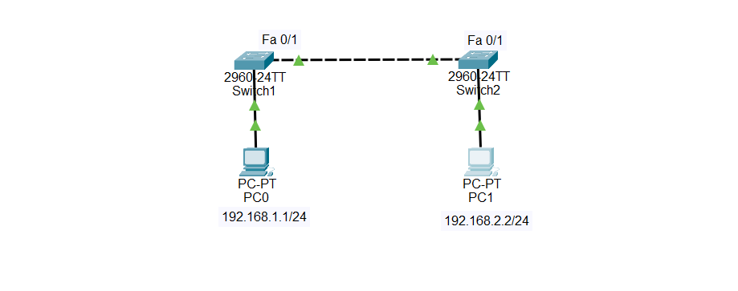

# Lab 01 — PC0 Cannot Ping PC1

## 🖥️ Broken Topology



---

## 🔴 Problem

**PC0 cannot ping PC1.**

The network is expected to allow PC0 and PC1 to communicate with each other.

---

## 🔎 Symptoms

From PC0, attempt to ping PC1:

```text
ping 192.168.2.2
```

The ping fails with:

```text
Request timed out.
```

---

## 🛠️ Troubleshooting

### Step 1 — Check PC0 IP Configuration

On PC0, check the IP configuration:

```text
ipconfig
```

PC0 is configured with:

```text
IP Address:   192.168.1.1
Subnet Mask:  255.255.255.0
```

Therefore, PC0 belongs to:

```text
192.168.1.0/24
```

---

### Step 2 — Check PC1 IP Configuration

On PC1:

```text
ipconfig
```

PC1 is configured with:

```text
IP Address:   192.168.2.2
Subnet Mask:  255.255.255.0
```

Therefore, PC1 belongs to:

```text
192.168.2.0/24
```

---

### Step 3 — Compare the Networks

PC0:

```text
192.168.1.1/24
Network: 192.168.1.0/24
```

PC1:

```text
192.168.2.2/24
Network: 192.168.2.0/24
```

The two PCs are in **different IP networks**.

---

### Step 4 — Check the Network Topology

The topology contains only Layer 2 switches:

```text
PC0 → Switch1 → Switch2 → PC1
```

There is no router or Layer 3 switch between the two IP networks.

A Layer 2 switch can forward Ethernet frames within the same Layer 2 network, but it does not perform routing between different IP networks.

---

## 🎯 Root Cause

PC0 and PC1 are configured in **different IP networks**:

```text
PC0 → 192.168.1.0/24
PC1 → 192.168.2.0/24
```

There is also **no Layer 3 device** to route traffic between these networks.

Therefore, PC0 cannot communicate with PC1.

---

## 🔧 Fix

There are two possible solutions.

### Solution 1 — Put Both PCs in the Same Network

Change PC1's IP address from:

```text
192.168.2.2/24
```

to:

```text
192.168.1.2/24
```

The final configuration becomes:

```text
PC0:
IP Address: 192.168.1.1
Subnet Mask: 255.255.255.0

PC1:
IP Address: 192.168.1.2
Subnet Mask: 255.255.255.0
```

Now both PCs belong to:

```text
192.168.1.0/24
```

---

### Solution 2 — Use a Layer 3 Device

Alternatively, the two networks can remain different:

```text
192.168.1.0/24
        |
       R1
        |
192.168.2.0/24
```

A router or Layer 3 switch would then route traffic between the two networks.

For this lab, **Solution 1** is used.

---

## ✅ Verification

After changing PC1's IP address to:

```text
192.168.1.2/24
```

From PC0:

```text
ping 192.168.1.2
```

Expected result:

```text
Reply from 192.168.1.2: bytes=32 time<1ms TTL=128
Reply from 192.168.1.2: bytes=32 time<1ms TTL=128
Reply from 192.168.1.2: bytes=32 time<1ms TTL=128
Reply from 192.168.1.2: bytes=32 time<1ms TTL=128
```

The ping is now successful.

---

## 📚 Lesson Learned

Devices that need to communicate directly at Layer 2 should be in the same IP subnet.

If devices are in different IP networks, a **Layer 3 device**, such as a router or Layer 3 switch, is required to route traffic between them.

---

## 📁 Lab File

Download the **broken Packet Tracer lab** and troubleshoot it yourself before reading the solution above.

**File:** `PC-Cannot-Ping-PC1.pkt`
