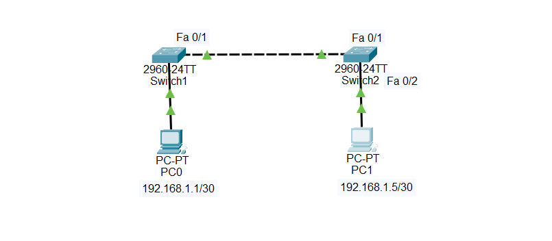

# Challenge 02 — PC0 Cannot Ping PC1

## 🖥️ Broken Topology




# 🔴 Problem

**PC0 cannot ping PC1.**

Your task is to troubleshoot the network and identify why PC0 cannot communicate with PC1.

> **Try to troubleshoot the lab yourself before reading the solution below.**

---

# 🔎 Symptoms

From **PC0**, try to ping **PC1**:

```text
ping 192.168.1.5
```

The ping fails with:

```text
Request timed out.
```

---

# 🛠️ Troubleshooting Steps

## Step 1 — Check PC0's IP Configuration

On PC0, run:

```text
ipconfig
```

PC0 has:

```text
IP Address:   192.168.1.1
Subnet Mask:  255.255.255.252
```

This is `/30`.

Therefore, PC0 belongs to:

```text
192.168.1.0/30
```

---

## Step 2 — Check PC1's IP Configuration

On PC1, run:

```text
ipconfig
```

PC1 has:

```text
IP Address:   192.168.1.5
Subnet Mask:  255.255.255.252
```

This is also `/30`.

PC1 belongs to:

```text
192.168.1.4/30
```

---

## Step 3 — Calculate the Subnets

The subnet mask is:

```text
255.255.255.252
```

Calculate the block size:

```text
256 - 252 = 4
```

Therefore, the `/30` networks increase by 4:

```text
192.168.1.0/30
192.168.1.4/30
192.168.1.8/30
192.168.1.12/30
...
```

### PC0

```text
192.168.1.0/30

Network:     192.168.1.0
Host:        192.168.1.1
Host:        192.168.1.2
Broadcast:   192.168.1.3
```

PC0:

```text
192.168.1.1
```

So PC0 is in:

```text
192.168.1.0/30
```

### PC1

```text
192.168.1.4/30

Network:     192.168.1.4
Host:        192.168.1.5
Host:        192.168.1.6
Broadcast:   192.168.1.7
```

PC1:

```text
192.168.1.5
```

So PC1 is in:

```text
192.168.1.4/30
```

---

## Step 4 — Compare the Networks

PC0:

```text
IP:       192.168.1.1
Network:  192.168.1.0/30
```

PC1:

```text
IP:       192.168.1.5
Network:  192.168.1.4/30
```

The two PCs are therefore in **different IP networks**.

```text
PC0
192.168.1.0/30
      ❌
      │
      │ Different networks
      │
      ❌
192.168.1.4/30
PC1
```

---

## Step 5 — Check the Network Topology

The topology contains:

```text
PC0 → Switch1 → Switch2 → PC1
```

Both switches are Layer 2 switches.

There is **no router or Layer 3 switch** between the two IP networks.

Therefore, there is no device available to route traffic between:

```text
192.168.1.0/30
```

and

```text
192.168.1.4/30
```

---

# 🎯 Root Cause

The root cause is that **PC0 and PC1 are configured in different `/30` IP networks**, while the topology contains only Layer 2 switches.

PC0:

```text
192.168.1.1/30
→ 192.168.1.0/30
```

PC1:

```text
192.168.1.5/30
→ 192.168.1.4/30
```

There is no Layer 3 device to route between these networks.

---

# 🔧 Fix

For this lab, both PCs should be placed in the **same IP network**.

Change PC1 from:

```text
192.168.1.5/30
```

to:

```text
192.168.1.2/30
```

The final configuration becomes:

### PC0

```text
IP Address:   192.168.1.1
Subnet Mask:  255.255.255.252
```

### PC1

```text
IP Address:   192.168.1.2
Subnet Mask:  255.255.255.252
```

Now both PCs belong to:

```text
192.168.1.0/30
```

---

# ✅ Verification

From PC0, run:

```text
ping 192.168.1.2
```

The ping should now succeed:

```text
Reply from 192.168.1.2
Reply from 192.168.1.2
Reply from 192.168.1.2
Reply from 192.168.1.2
```

### Result

```text
PC0  ────────────────>  PC1
      Ping Successful
```

The connectivity problem has been resolved.

---

# 📚 Lesson Learned

A `/30` subnet contains **4 addresses**:

```text
Network
Host
Host
Broadcast
```

The subnet mask for `/30` is:

```text
255.255.255.252
```

The block size is:

```text
256 - 252 = 4
```

Therefore, `/30` networks start at:

```text
.0
.4
.8
.12
.16
...
```

Most importantly:

> **Devices that need to communicate directly through Layer 2 must be in the same IP subnet.**

If devices are in different IP networks, a **Layer 3 device** such as a router or Layer 3 switch is required.

---

## 📁 Lab File

The Packet Tracer file included in this folder is intentionally **broken**.

Download:

```text
Challenge-02.pkt
```

Try to troubleshoot and fix the problem yourself before checking the solution in this README.
