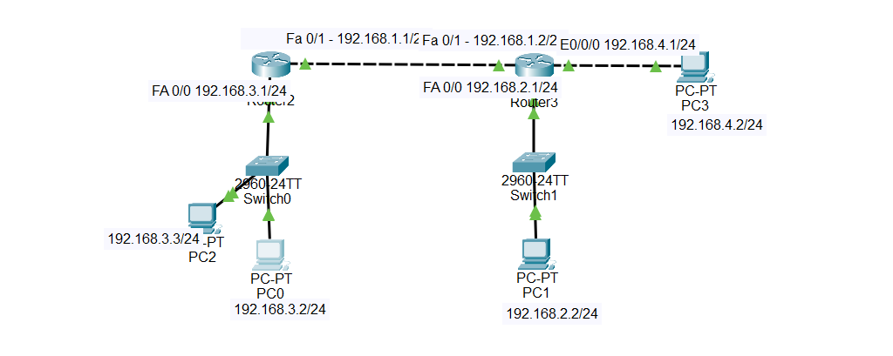

# Challenge 03 — PC0 Cannot Reach Other Networks

## 🖥️ Broken Topology




---

# 🔴 Problem

**PC0 cannot communicate with devices on other networks.**

The other PCs are able to communicate with each other, but PC0 cannot reach remote networks.

### PC0 Configuration

```text
IP Address:   192.168.3.2
Subnet Mask:  255.255.255.0
Default Gateway: NOT CONFIGURED
```

---

# 🔎 Symptoms

From PC0, test communication with another device on the local network:

```text
ping 192.168.3.3
```

This should work because PC2 is on the same network as PC0.

However, when PC0 tries to reach a different network, for example PC1:

```text
ping 192.168.2.2
```

the ping fails.

PC0 is therefore able to communicate with devices on its **local subnet**, but it cannot communicate with devices on **remote networks**.

---

# 🛠️ Troubleshooting Steps

## Step 1 — Check PC0 IP Configuration

On PC0, open:

```text
Desktop → IP Configuration
```

The configuration is:

```text
IP Address:       192.168.3.2
Subnet Mask:      255.255.255.0
Default Gateway:  [Blank]
```

The IP address and subnet mask are correctly configured.

However, the **Default Gateway field is empty**.

---

## Step 2 — Test the Local Network

From PC0:

```text
ping 192.168.3.3
```

PC2 is:

```text
192.168.3.3/24
```

PC0 is:

```text
192.168.3.2/24
```

Both devices belong to:

```text
192.168.3.0/24
```

Therefore, they can communicate directly through the switch.

### Result

```text
PC0 → PC2
192.168.3.2 → 192.168.3.3

Ping: SUCCESS
```

This tells us that PC0's local connectivity is working.

---

## Step 3 — Test a Remote Network

Now test PC1:

```text
ping 192.168.2.2
```

PC1 belongs to:

```text
192.168.2.0/24
```

PC0 belongs to:

```text
192.168.3.0/24
```

These are different networks.

Therefore, PC0 needs to send the traffic to a router.

---

## Step 4 — Identify the Correct Default Gateway

Look at Router2:

```text
Router2 Fa0/0:
192.168.3.1/24
```

Router2 is directly connected to PC0's network:

```text
PC0 Network:
192.168.3.0/24

Router2:
192.168.3.1
```

Therefore, the correct default gateway for PC0 is:

```text
192.168.3.1
```

---

## Step 5 — Check PC0's Gateway

PC0 currently has:

```text
Default Gateway: [Blank]
```

Without a default gateway, PC0 does not know where to send traffic destined for another network.

This explains why:

```text
PC0 → PC2
```

works, but:

```text
PC0 → PC1
```

does not.

---

# 🎯 Root Cause

**PC0 does not have a default gateway configured.**

PC0 is connected to the `192.168.3.0/24` network, whose router interface is:

```text
Router2 Fa0/0
192.168.3.1
```

Because PC0 has no default gateway, it cannot forward traffic destined for remote networks.

---

# 🔧 Fix

Configure the default gateway on PC0.

Set:

```text
IP Address:       192.168.3.2
Subnet Mask:      255.255.255.0
Default Gateway:  192.168.3.1
```

The important change is:

```text
Default Gateway:
192.168.3.1
```

---

# ✅ Verification

After configuring the default gateway, test PC2 again:

```text
ping 192.168.3.3
```

Expected:

```text
Reply from 192.168.3.3
```

Then test PC1:

```text
ping 192.168.2.2
```

Expected:

```text
Reply from 192.168.2.2
```

You can also test PC3:

```text
ping 192.168.4.2
```

Expected:

```text
Reply from 192.168.4.2
```

### Final Result

```text
PC0
192.168.3.2
    |
    | Default Gateway
    ↓
Router2
192.168.3.1
    |
    ↓
Router3
    |
    ├── PC1
    │   192.168.2.2
    │
    └── PC3
        192.168.4.2
```

PC0 can now communicate with the other networks.

---

# 📚 Lesson Learned

A **default gateway** is required when a host needs to communicate with devices outside its local IP network.

In this lab:

```text
PC0 Network:       192.168.3.0/24
Default Gateway:   192.168.3.1
```

PC0 can communicate directly with devices in its own subnet without a gateway, but traffic destined for another subnet must be sent to the router through the default gateway.

---

# 📁 Lab File

The Packet Tracer file in this folder is intentionally **broken**.

Download:

```text
Challenge-03.pkt
```

Try to troubleshoot the problem yourself before reading the solution in this README.
