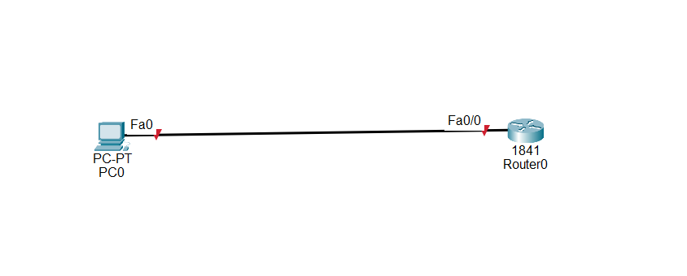
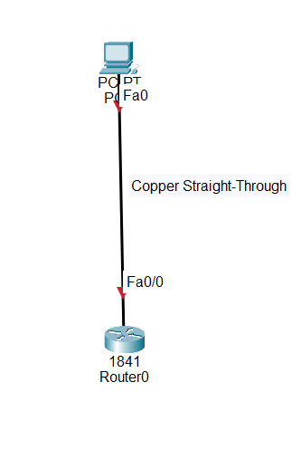
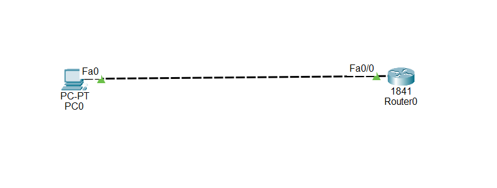
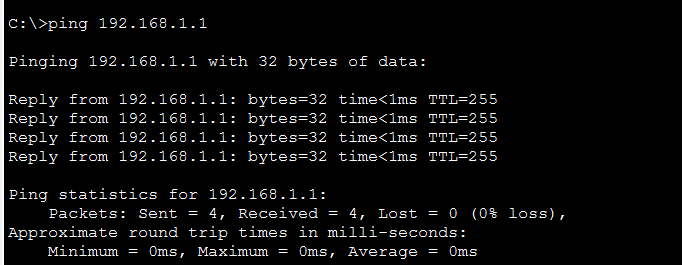

# Challenge 04 — Incorrect Cable Type

## 🖥️ Broken Topology




---

# 🔴 Problem

**PC0 cannot communicate with Router0.**

The physical connection between PC0 and Router0 appears to be connected, but communication is not working.

Your task is to troubleshoot the connection and identify the problem.

> **Try to solve the problem yourself before reading the solution below.**

---

# 🔎 Symptoms

When checking the connection between PC0 and Router0, the link does not come up as expected.

The connection is currently using:




PC0 cannot successfully communicate with Router0.

---

# 🛠️ Troubleshooting Steps

## Step 1 — Check the Physical Connection

First, inspect the cable connecting PC0 and Router0.

The connection is:

```text
PC0 Fa0 ───────── Router0 Fa0/0
```

Check the cable type being used in Packet Tracer.

The current cable is:

```text
Copper Straight-Through
```

---

## Step 2 — Determine the Correct Cable Type

This is a direct connection between:

```text
PC ↔ Router
```

Using the traditional Ethernet cabling rules used in this Packet Tracer lab, a **Copper Cross-Over** cable should be used for this connection.

Therefore, the current cable type is incorrect.

---

# 🎯 Root Cause

The root cause is an **incorrect Ethernet cable type**.

PC0 and Router0 are directly connected using a:

```text
Copper Straight-Through
```

Instead, the connection should use:

```text
Copper Cross-Over
```

---

# 🔧 Fix

Remove the incorrect cable:

```text
Copper Straight-Through
```

Then connect the devices using:

```text
Copper Cross-Over
```

The final connection should be:



---

# ✅ Verification

After replacing the cable, check the link between PC0 and Router0.

The interfaces should come up if the interface configuration and IP addressing are also correct.

You can then test connectivity using:

```text
ping <Router0-IP-address>
```

A successful result should show replies from Router0.

Example:




### Result

```text
PC0 ──────── Router0
     ✅
Communication restored
```

---

# 📚 Lesson Learned

When troubleshooting network connectivity, always check the **physical layer first**.

For traditional Ethernet cabling:

| Connection      | Cable                   |
| --------------- | ----------------------- |
| PC ↔ Switch     | Copper Straight-Through |
| PC ↔ Router     | Copper Cross-Over       |
| Switch ↔ Switch | Copper Cross-Over       |
| Router ↔ Router | Copper Cross-Over       |
| Switch ↔ Router | Copper Straight-Through |

> **Note:** Modern Ethernet devices often support Auto-MDIX, which can allow either cable type to work. This lab intentionally uses the traditional cabling rules for troubleshooting practice.

---

# 📁 Lab File

The Packet Tracer file in this folder is intentionally **broken**.

**File:** `Challenge-04.pkt`

Download the file, identify the physical-layer problem, and fix it before reading the solution above.
