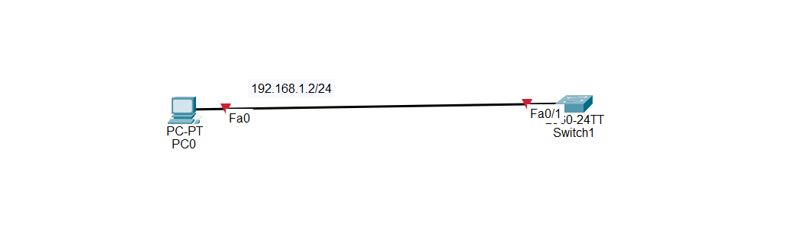
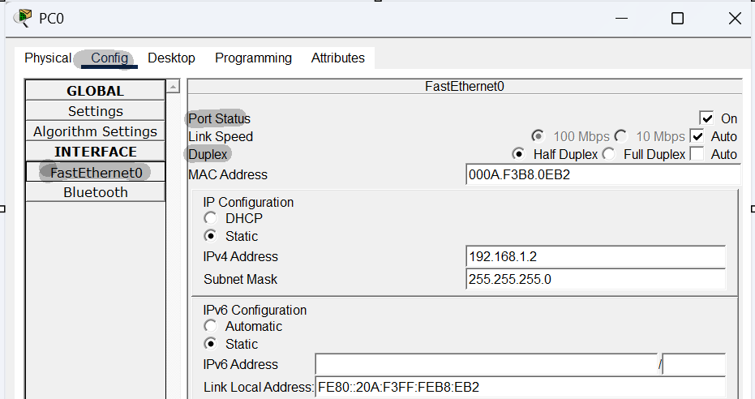
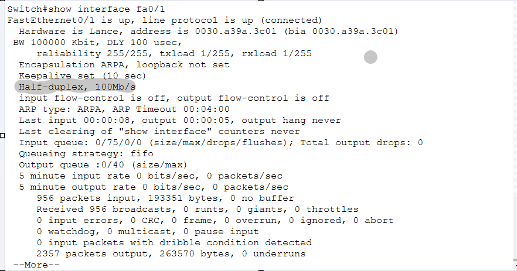
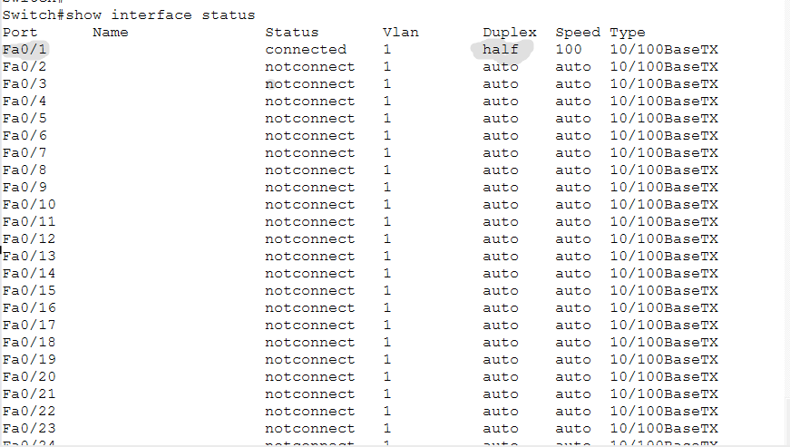

# 🔧 Challenge 5 — Why Is the Link Red?

## 🖥️ Topology

**[SCREENSHOT — Replace this text diagram with an actual screenshot of the broken Packet Tracer topology.]**



---

## 🚨 Problem

The link between **PC0 and Switch1 is red**.

Determine why the connection is not working correctly.

---

## 🔎 Your Task

Troubleshoot the network and determine:

* What is causing the red link?
* What is the root cause?
* How can you fix it?
* How can you verify the fix?

Do not immediately change the configuration. Investigate first.

---

# 🧪 Troubleshooting Steps

## Step 1 — Check the Cable

Verify that PC0 and Switch1 are connected using the appropriate cable.

```text
PC0 Fa0
   |
   | Copper Straight-Through
   |
Switch1 Fa0/1
```

The cable type and connection points are correct.

---

## Step 2 — Check PC0's Interface

Go to:

**PC0 → Config → FastEthernet0**

Check:

* Port Status
* Duplex
* Speed




You should find that the PC's Ethernet interface is enabled, but its duplex setting needs to be examined carefully.

---

## Step 3 — Check Switch1

On Switch1, run:

```text
show interfaces fa0/1
```

Check:

* Interface status
* Duplex
* Speed



---

## Step 4 — Compare Both Ends

Compare the Ethernet settings on both sides:

```text
PC0 Fa0                  Switch1 Fa0/1
---------                --------------
Duplex: Half       ↔     Duplex: Full
Speed: 100 Mbps    ↔     Speed: 100 Mbps
```

The speed is the same, but the duplex settings are different.

---

# 🎯 Root Cause

The root cause is a **duplex mismatch** between PC0 and Switch1.

PC0 is configured to operate in:

```text
Half-duplex
```

while Switch1 Fa0/1 is configured to operate in:

```text
Full-duplex
```

Duplex determines how a device sends and receives Ethernet traffic.

With **half-duplex**, a device cannot send and receive at the same time.

With **full-duplex**, a device can send and receive simultaneously.

When the two ends of a connection use incompatible duplex settings, they do not communicate efficiently. This can result in collisions, packet loss, retransmissions, and poor network performance.

In this lab, the incorrect duplex configuration is what needs to be corrected.

---

# 🔧 Fix

There are several ways to correct the mismatch.

### Option 1 — Change PC0 to Full-Duplex

Go to:

**PC0 → Config → FastEthernet0**

Change:

```text
Duplex: Half
```

to:

```text
Duplex: Full
```

Now both sides use:

```text
PC0       → Full-duplex
Switch1   → Full-duplex
```

---

### Option 2 — Set PC0 to Auto

You can also configure PC0's duplex setting to:

```text
Auto
```

This allows the interface to negotiate the appropriate setting with the switch.

---

### Option 3 — Configure the Switch

You can change the switch interface:

```text
Switch# configure terminal
Switch(config)# interface fa0/1
Switch(config-if)# duplex half
```

However, this would make the switch match the PC's current setting.

A better general approach is to allow both sides to negotiate automatically:

```text
Switch(config-if)# duplex auto
Switch(config-if)# speed auto
```

---

# ✅ Verification

After fixing the problem, verify the interface again.

On Switch1:

```text
show interfaces fa0/1
```

Check the duplex and interface status.

You can also use:

```text
show interfaces status
```

The interface should now be operational.

Example:

```text
Port      Status       Vlan   Duplex   Speed
Fa0/1     connected    1      full     100
```



Finally, test connectivity from PC0 to confirm that communication has been restored.

---

# 📌 Final Diagnosis

**Problem:**
The link between PC0 and Switch1 is red.

**Symptom:**
The connection is not operating correctly.

**Investigation:**
The cable and interfaces were checked. The duplex and speed settings on both ends were compared.

**Root Cause:**
PC0 was configured for **half-duplex**, while Switch1 Fa0/1 was configured for **full-duplex**.

**Fix:**
Configure both sides with compatible duplex settings, preferably using **Auto/Auto** or matching duplex settings.

**Verification:**
The interface becomes operational and connectivity is restored.

---

# 🧠 Troubleshooting Lesson

When troubleshooting an Ethernet connection, always compare the settings on **both ends** of the link.

```text
Physical connection
        ↓
Interface status
        ↓
Speed
        ↓
Duplex
        ↓
Other configuration
        ↓
Root cause
        ↓
Fix
        ↓
Verify
```

A duplex mismatch may not always completely break communication, but it can cause serious network performance and connectivity problems.
