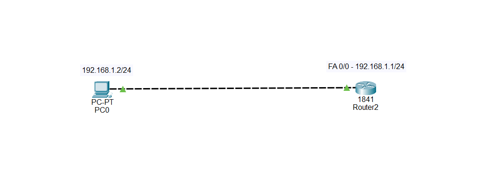
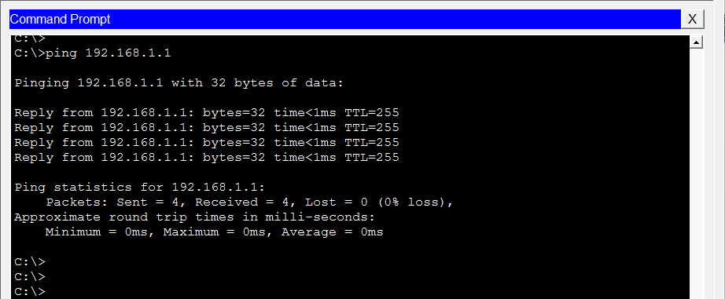
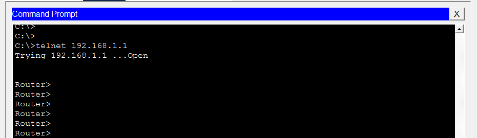
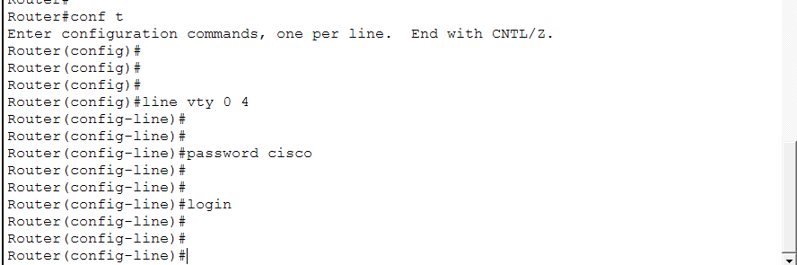

# 🔐 Challenge 2 — Telnet Access Without Authentication

## 🖥️ Topology



---

## 🚨 Problem

PC0 is connected to Router2 and can successfully reach the router using Telnet.

However, when you initiate a Telnet connection from PC0 to Router2, **the router does not request a password**.

Your task is to determine why this is happening and correct the configuration.

---

## 🔎 Your Task

Troubleshoot the Telnet connection and determine:

1. Why does Telnet connect without requesting a password?
2. Which configuration is responsible?
3. What is the root cause?
4. How can you fix it?
5. How can you verify the fix?

Do not immediately change the configuration. Investigate first.

---

# 🧪 Troubleshooting Steps

## Step 1 — Verify Connectivity

From PC0, ping the router:

```text
PC> ping 192.168.1.1
```

The ping should succeed.



This confirms that basic IP connectivity between PC0 and Router2 is working.

---

## Step 2 — Test Telnet

From PC0:

```text
PC> telnet 192.168.1.1
```

Observe what happens.

The Telnet session opens, but the router does not request a password.



---

## Step 3 — Check the Router's VTY Configuration

On Router2, run:

```text
Router# show running-config
```

Look for the VTY configuration.

You should find:

```text
line vty 0 4
 password cisco
 no login
```


---

## Step 4 — Analyze the Configuration

Notice that a password has been configured:

```text
password cisco
```

But there is also:

```text
no login
```

Ask yourself:

> If a password exists, why isn't the router asking for it?

---

# 🎯 Root Cause

The root cause is the command:

```text
no login
```

configured under the VTY lines.

The command:

```text
password cisco
```

creates a password for the VTY lines, but:

```text
no login
```

tells the router **not to use the VTY password for authentication**.

Therefore, the router allows the Telnet session without displaying a password prompt.

The configuration is essentially:

```text
VTY password configured
        ↓
     no login
        ↓
Password authentication disabled
        ↓
Telnet connection without password ❌
```

---

# 🔧 Fix

Enter the VTY configuration mode:

```text
Router# configure terminal
Router(config)# line vty 0 4
Router(config-line)# login
Router(config-line)# end
```

The VTY configuration should now look like:

```text
line vty 0 4
 password cisco
 login
```

The important change is:

```text
no login
     ↓
login
```



---

# 🧪 Verification

From PC0, start a new Telnet session:

```text
PC> telnet 192.168.1.1
```

The router should now display a password prompt:

```text
User Access Verification

Password:
```

Enter:

```text
cisco
```


You should then receive access to the router:

```text
Router>
```

---

# 📌 Final Diagnosis

**Problem:**
PC0 can Telnet to Router2 without entering a password.

**Symptom:**
The Telnet session opens without displaying a password prompt.

**Investigation:**
IP connectivity was verified with ping, Telnet was tested, and the router's VTY configuration was examined.

**Root Cause:**
The VTY lines were configured with `no login`, which disables password authentication even though a VTY password was configured.

**Fix:**
Replace `no login` with:

```text
login
```

under `line vty 0 4`.

**Verification:**
Reconnect using Telnet and confirm that the router requests the configured password before granting access.

---

# 🧠 Troubleshooting Lesson

A configured VTY password does not automatically mean that the router will ask for it.

For a simple VTY password authentication setup, you need both:

```text
line vty 0 4
 password cisco
 login
```

Remember:

```text
password cisco
       +
     login
       ↓
Password authentication enabled
```

Whereas:

```text
password cisco
       +
   no login
       ↓
Password authentication disabled
```
