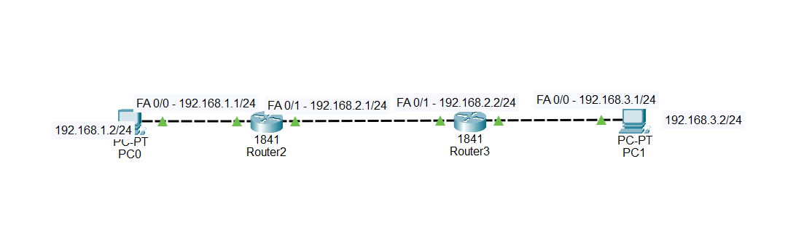
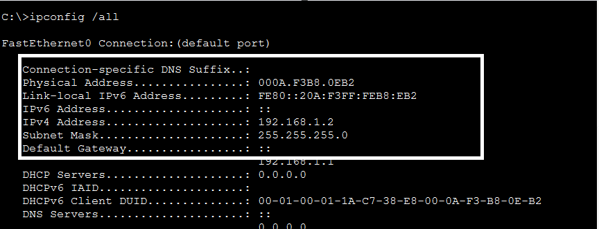
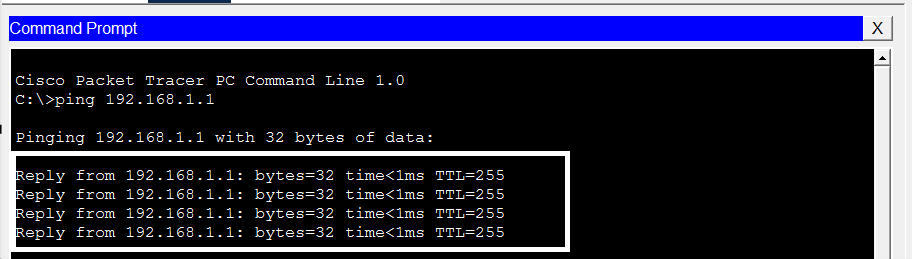
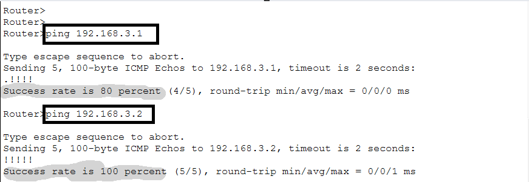
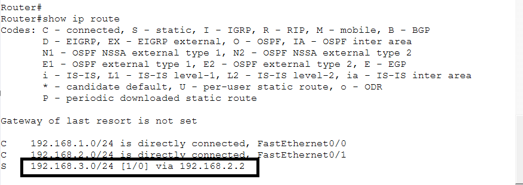
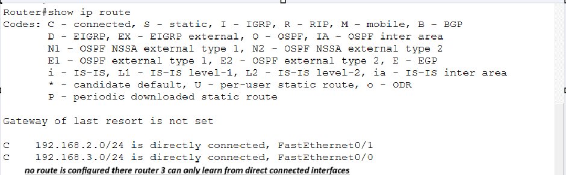
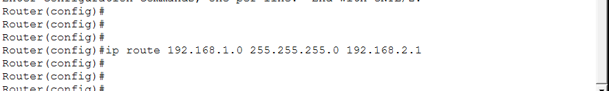
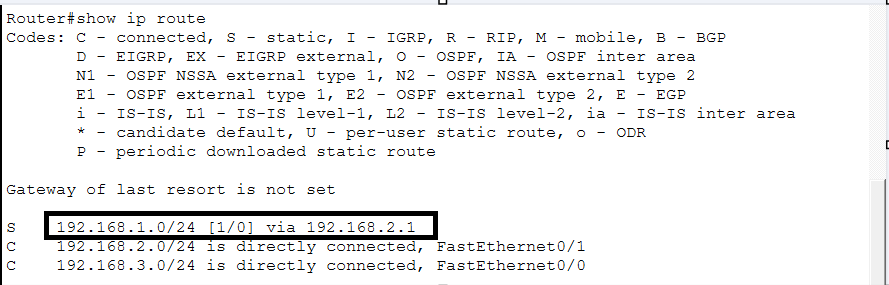
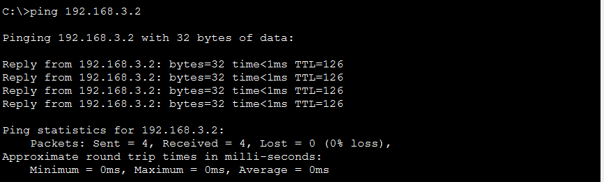

# 🔧 Challenge 3 — PC Cannot Reach the Remote Network

## 🖥️ Topology



# 🚨 Problem

PC0 is unable to ping PC1 on the remote network `192.168.3.0/24`.

However, Router2 can successfully reach the remote `192.168.3.0/24` network.

Your task is to investigate why communication works from Router2 but fails when the traffic originates from PC0.

---

# 🔎 Your Task

Troubleshoot the network and determine:

1. Why can Router2 reach the remote network?
2. Why can't PC0 reach the remote network?
3. Which router is missing information?
4. What is the root cause?
5. How can you fix it?
6. How can you verify the solution?

---

# 🧪 Troubleshooting Steps

## Step 1 — Check PC0's IP Configuration

On PC0, run:

```text
ipconfig /all
```

Check:

* IPv4 address
* Subnet mask
* Default gateway



PC0 should have:

```text
IPv4 Address:     192.168.1.2
Subnet Mask:      255.255.255.0
Default Gateway:  192.168.1.1
```

---

## Step 2 — Test the Local Gateway

From PC0:

```text
PC> ping 192.168.1.1
```



If this succeeds, PC0 can communicate with Router2.

This means the local connection between PC0 and Router2 is working.

---

## Step 3 — Test the Remote Network from Router2

On Router2:

```text
Router2# ping 192.168.3.1
```

You can also test PC1:

```text
Router2# ping 192.168.3.2
```



This confirms that Router2 has a path toward the `192.168.3.0/24` network.

---

## Step 4 — Check Router2's Routing Table

On Router2:

```text
Router2# show ip route
```

Look for the route to:

```text
192.168.3.0/24
```



Router2 should have a route similar to:

```text
S    192.168.3.0/24 [1/0] via 192.168.2.2
```

This means Router2 knows how to forward traffic toward Router3.

---

## Step 5 — Check Router3's Routing Table

Now investigate Router3:

```text
Router3# show ip route
```



You may see:

```text
C    192.168.2.0/24 is directly connected, FastEthernet0/1
C    192.168.3.0/24 is directly connected, FastEthernet0/0
```

Notice that Router3 knows about:

```text
192.168.2.0/24
192.168.3.0/24
```

But look carefully for:

```text
192.168.1.0/24
```

---

# 🔍 Analyze the Routing Path

For PC0 to communicate with PC1, there must be a path in **both directions**.

### Forward path

```text
PC0
192.168.1.2
     ↓
Router2
192.168.1.1
     ↓
192.168.2.0/24
     ↓
Router3
192.168.3.1
     ↓
PC1
192.168.3.2
```

Router2 knows how to send the packet toward Router3.

### Return path

PC1 must send the reply back:

```text
PC1
192.168.3.2
     ↓
Router3
     ↓
192.168.2.0/24
     ↓
Router2
     ↓
192.168.1.0/24
     ↓
PC0
192.168.1.2
```

This is where the problem occurs.

---

# 🎯 Root Cause

The root cause is that **Router3 does not have a route to the `192.168.1.0/24` network**.

Router3 only knows about its directly connected networks:

```text
192.168.2.0/24
192.168.3.0/24
```

It does not know that the `192.168.1.0/24` network is reachable through Router2.

Therefore, when PC0 sends a packet to PC1, the request can travel toward Router3, but the return traffic does not have a route back to PC0.

The problem can be represented as:

```text
             FORWARD
PC0 ─────→ Router2 ─────→ Router3 ─────→ PC1
                                         
             RETURN
PC0 ←───── Router2 ←───── Router3
                             
                         ❌ No route to
                         192.168.1.0/24
```

The missing information is therefore a **route on Router3 to the `192.168.1.0/24` network**.

---

# 🔧 Fix

Configure a static route on Router3 pointing to Router2.

On Router3:

```text
Router3# configure terminal
Router3(config)# ip route 192.168.1.0 255.255.255.0 192.168.2.1
Router3(config)# end
```

Explanation:

```text
192.168.1.0       → PC0's network
255.255.255.0     → subnet mask
192.168.2.1       → Router2's next-hop address
```



---

# ✅ Verification

First, check Router3's routing table:

```text
Router3# show ip route
```

You should now see something similar to:

```text
S    192.168.1.0/24 [1/0] via 192.168.2.1
C    192.168.2.0/24 is directly connected, FastEthernet0/1
C    192.168.3.0/24 is directly connected, FastEthernet0/0
```



Now return to PC0 and test:

```text
PC> ping 192.168.3.2
```

The ping should now succeed.



---

# 📌 Final Diagnosis

**Problem:**
PC0 cannot reach PC1 on the remote `192.168.3.0/24` network.

**Symptom:**
Router2 can reach the remote network, but PC0 cannot.

**Investigation:**
PC0's local connectivity was checked, Router2's routing table was examined, and Router3's routing table was inspected.

**Root Cause:**
Router3 had no route to PC0's `192.168.1.0/24` network. It only knew about its directly connected networks.

**Fix:**
Configure a static route on Router3:

```text
ip route 192.168.1.0 255.255.255.0 192.168.2.1
```

**Verification:**
PC0 can successfully ping the remote PC1 at `192.168.3.2`.

---

# 🧠 Troubleshooting Lesson

A router being able to reach a network does **not automatically mean that every device behind that router can reach it**.

For successful end-to-end communication, always check:

```text
Forward Path
     ↓
PC0 → Router2 → Router3 → PC1
     
AND

Return Path
     ↓
PC1 → Router3 → Router2 → PC0
```

**Always check both directions when troubleshooting routing problems.**
