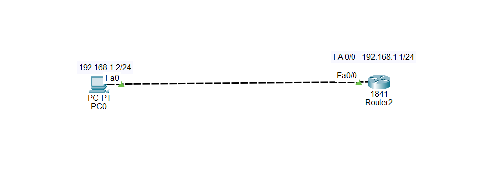
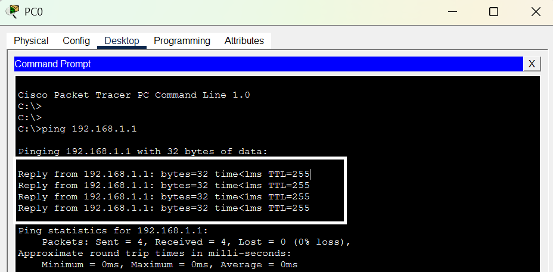
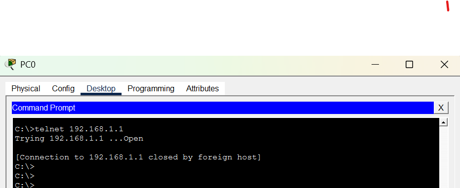
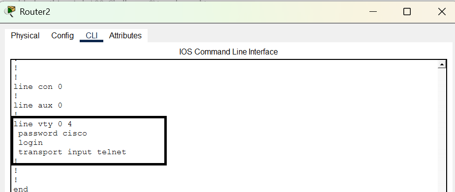
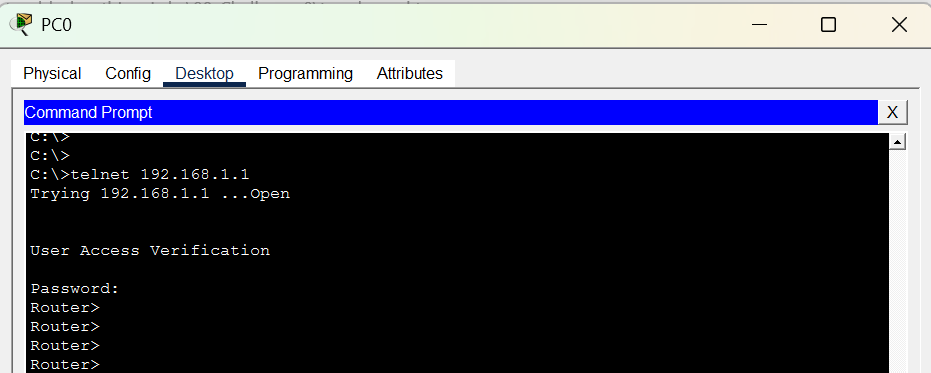

# Challenge 4 — Cannot Access the Router Remotely

## Network Topology




---

## Challenge

PC0 is connected to Router2, and the physical link is working.

You have been asked to remotely access Router2 from PC0 using **Telnet**.

However, when you try to establish the remote connection, it does not work.

Your task is to:

1. Identify why Telnet access is failing.
2. Troubleshoot the router configuration.
3. Make the necessary configuration changes.
4. Verify that PC0 can successfully access Router2 using Telnet.

**Do not change the IP addressing unless your troubleshooting shows that it is necessary.**

---

## IP Addressing

| Device  | Interface | IP Address  | Subnet Mask   |
| ------- | --------- | ----------- | ------------- |
| PC0     | Fa0       | 192.168.1.2 | 255.255.255.0 |
| Router2 | Fa0/0     | 192.168.1.1 | 255.255.255.0 |

The physical link between PC0 and Router2 is **green**.

---

## Router Configuration

The router currently contains the following VTY configuration:

```text
line vty 0 4
 password cisco
 no login
 transport input ssh
```

---

## Symptoms

When you try to remotely access Router2 from PC0 using Telnet, the connection fails.

The physical connection is working, and the router's FastEthernet interface has the correct IP address.

Your task is to determine what is preventing Telnet access.

---

## Troubleshooting

### Step 1 — Verify connectivity

From PC0, open:

**Desktop → Command Prompt**

Test connectivity to the router:

```bash
ping 192.168.1.1
```

The ping should succeed.



---

### Step 2 — Try Telnet

From PC0:

```bash
telnet 192.168.1.1
```

Observe the result.



---

### Step 3 — Check the VTY configuration

On Router2:

```bash
Router# show running-config
```

Look at:

```text
line vty 0 4
```

You should notice:

```text
password cisco
no login
transport input ssh
```

Think carefully about what these commands mean.

* What protocol is currently allowed?
* Is the router configured to request the VTY password?
* Is Telnet allowed?

---

## Root Cause

The router is configured to accept **SSH only**:

```text
transport input ssh
```

Therefore, incoming Telnet connections are not permitted.

There is also another configuration problem:

```text
no login
```

This disables VTY password authentication.

So, if the requirement is to access the router using **Telnet with the configured password**, both settings need to be corrected.

---

## Fix

Enter configuration mode:

```bash
Router# configure terminal
```

Enter the VTY lines:

```bash
Router(config)# line vty 0 4
```

Enable password authentication:

```bash
Router(config-line)# login
```

Allow Telnet:

```bash
Router(config-line)# transport input telnet
```

Exit configuration mode:

```bash
Router(config-line)# end
```

The final configuration should look like:

```text
line vty 0 4
 password cisco
 login
 transport input telnet
```

---

## Verify the Configuration

Run:

```bash
Router# show running-config
```

Confirm that the VTY configuration contains:

```text
line vty 0 4
 password cisco
 login
 transport input telnet
```


---

## Test Telnet Again

From PC0:

```bash
telnet 192.168.1.1
```

The router should now request the password.

Enter:

```text
cisco
```

You should successfully access Router2.


---

## What You Learned

Three commands have different purposes:

```text
password cisco
```

Sets the password for the VTY line.

```text
login
```

Tells the router to require the configured VTY password.

```text
transport input telnet
```

Allows incoming Telnet connections.

Remember:

```text
transport input telnet
        ↓
Allows Telnet

login
        ↓
Requires authentication

password cisco
        ↓
Password used for authentication
```

### Important

`ip cef` has nothing to do with Telnet or SSH.

**CEF = Cisco Express Forwarding**, which is used by Cisco IOS to efficiently forward packets.

For remote access, the important commands here are:

```text
transport input telnet
transport input ssh
```
