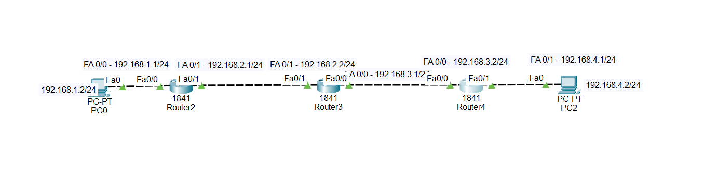
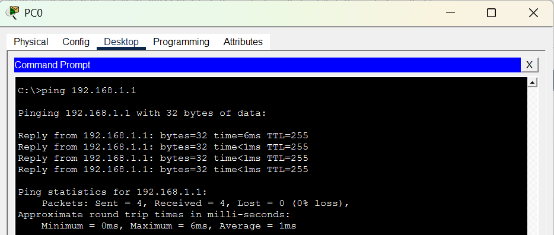
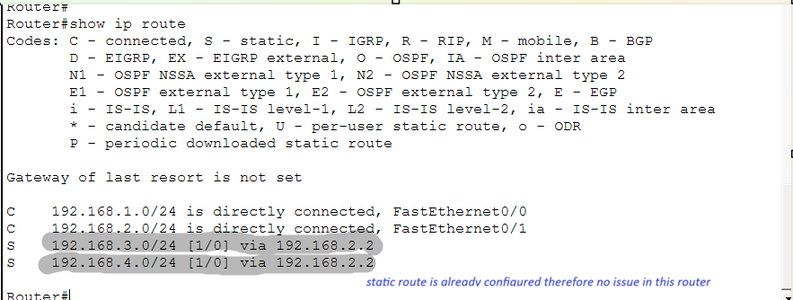
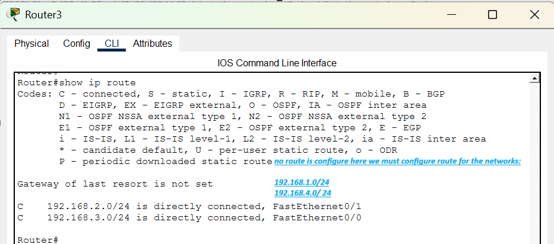
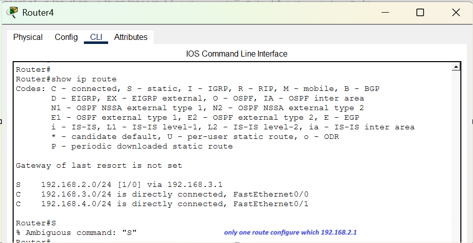
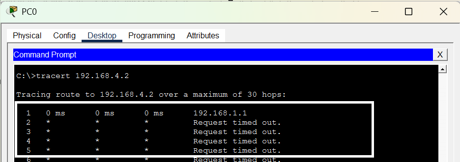
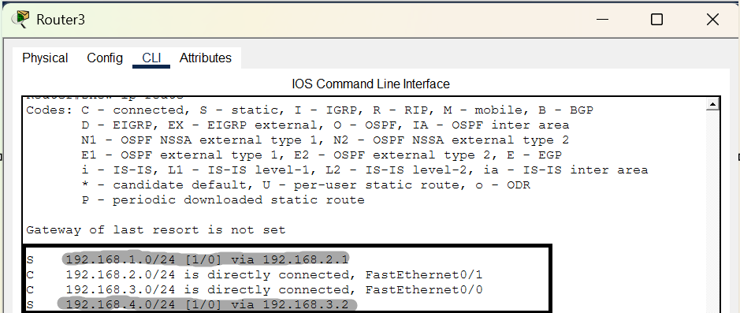
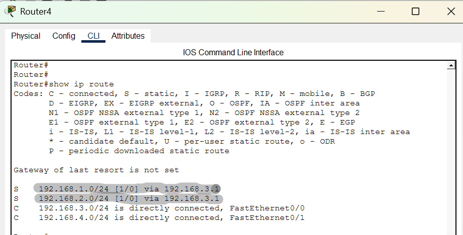
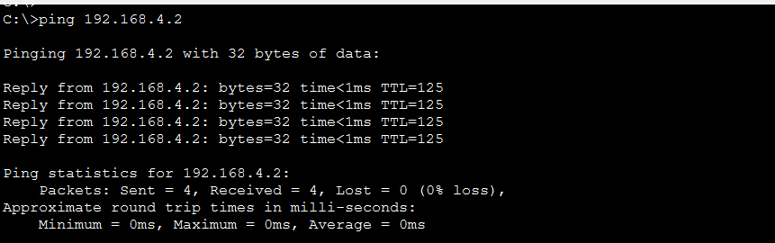

# Challenge 9 — Cannot Reach the 192.168.4.0/24 Network

## Network Topology



---

## Challenge

PC0 needs to communicate with the network:

```text
192.168.4.0/24
```

The topology and interfaces are already configured, but when you try to ping the remote network, you receive **unreachable responses**.

For example:

```bash
PC0> ping 192.168.4.2
```

The ping is unsuccessful.

### Your Task

Troubleshoot the network and make the necessary routing changes so that:

```text
PC0 → 192.168.4.2
```

can communicate successfully.

**Do not rebuild the topology.**

---

## IP Addressing

| Device  | Interface | IP Address     |
| ------- | --------- | -------------- |
| PC0     | Fa0       | 192.168.1.2/24 |
| Router2 | Fa0/0     | 192.168.1.1/24 |
| Router2 | Fa0/1     | 192.168.2.1/24 |
| Router3 | Fa0/1     | 192.168.2.2/24 |
| Router3 | Fa0/0     | 192.168.3.1/24 |
| Router4 | Fa0/0     | 192.168.3.2/24 |
| Router4 | Fa0/1     | 192.168.4.1/24 |
| PC2     | Fa0       | 192.168.4.2/24 |

---

## Symptoms

When PC0 attempts to reach PC2:

```bash
PC0> ping 192.168.4.2
```

the ping fails with unreachable responses.

The network contains several routers, so you need to determine whether the problem is related to:

* Routing on Router2
* Routing on Router3
* Routing on Router4
* The forward path
* The return path

---

## Troubleshooting

### Step 1 — Test the Local Gateway

From PC0:

```bash
PC0> ping 192.168.1.1
```

This checks communication between PC0 and Router2.



---

### Step 2 — Check Router2's Routing Table

On Router2:

```bash
Router2# show ip route
```

Look for routes toward:

```text
192.168.4.0/24
```



---

### Step 3 — Check Router3's Routing Table

On Router3:

```bash
Router3# show ip route
```

Check whether Router3 knows how to reach:

```text
192.168.1.0/24
```

and:

```text
192.168.4.0/24
```


---

### Step 4 — Check Router4's Routing Table

On Router4:

```bash
Router4# show ip route
```

Look for routes to:

```text
192.168.1.0/24
192.168.2.0/24
192.168.4.0/24
```



---

### Step 5 — Trace the Path

From PC0, use:

```bash
PC0> tracert 192.168.4.2
```

Observe where the traffic stops.


---

## Root Cause

The problem is caused by **missing static routes**.

### Router3

Router3 has **no static routes configured** for the remote networks.

Router3 needs routes to networks that are not directly connected to it.

For example, Router3 needs to know how to reach:

```text
192.168.1.0/24
192.168.4.0/24
```

### Router4

Router4 has only one static route:

```bash
ip route 192.168.2.0 255.255.255.0 192.168.3.1
```

This tells Router4:

> To reach 192.168.2.0/24, send the packet to 192.168.3.1.

However, this is not enough for complete end-to-end communication between PC0 and PC2.

---

# Solution

You need to configure the missing static routes.

## Router3

Router3 needs a route toward the PC0 network:

```bash
Router3# configure terminal
Router3(config)# ip route 192.168.1.0 255.255.255.0 192.168.2.1
```

Router3 also needs a route toward the PC2 network:

```bash
Router3(config)# ip route 192.168.4.0 255.255.255.0 192.168.3.2
```

Then:

```bash
Router3(config)# end
```

---

## Router4

Router4 already has:

```bash
ip route 192.168.2.0 255.255.255.0 192.168.3.1
```

But Router4 also needs to know how to return traffic toward the PC0 network:

```bash
Router4# configure terminal
Router4(config)# ip route 192.168.1.0 255.255.255.0 192.168.3.1
Router4(config)# end
```

---

## Verify the Routes

On Router3:

```bash
Router3# show ip route
```

You should now see static routes marked with:

```text
S
```



On Router4:

```bash
Router4# show ip route
```



---

## Final Test

From PC0:

```bash
PC0> ping 192.168.4.2
```

The ping should now succeed.


---

# Troubleshooting Lesson

When several routers are connected together, **every router must know where to send traffic**.

For communication:

```text
PC0
 ↓
Router2
 ↓
Router3
 ↓
Router4
 ↓
PC2
```

there must be a valid route **forward** toward the destination.

There must also be a valid **return route** back to the source.

### Remember:

> **A successful route in one direction is not enough. End-to-end communication requires a return path.**

Useful commands for future troubleshooting:

```bash
show ip route
```

```bash
show running-config
```

```bash
ping <destination>
```

```bash
tracert <destination>
```

or from Cisco IOS:

```bash
traceroute <destination>
```
