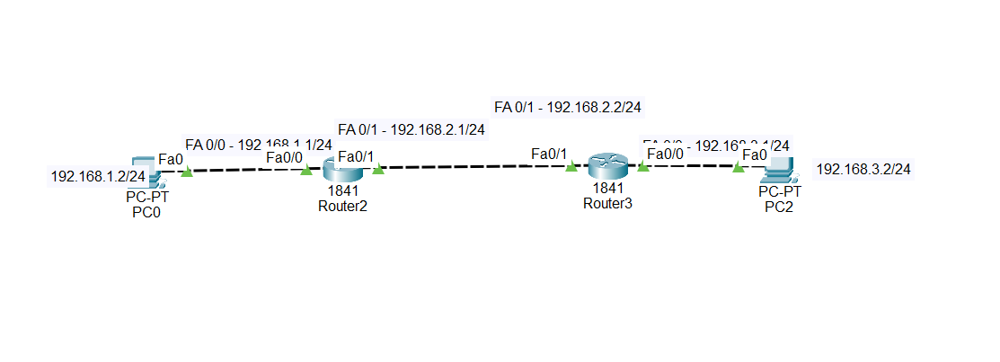
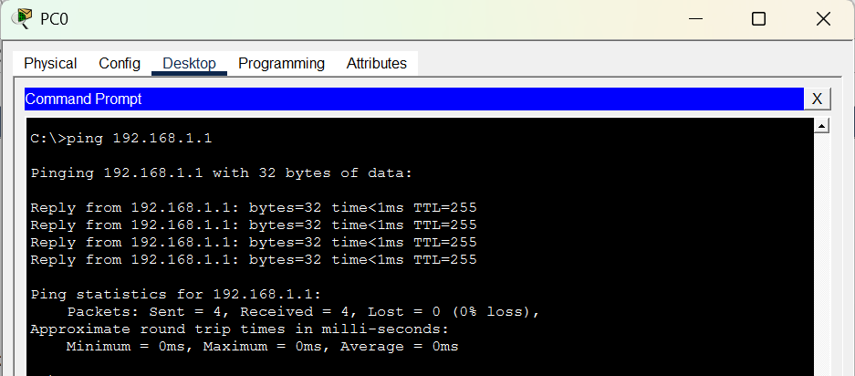
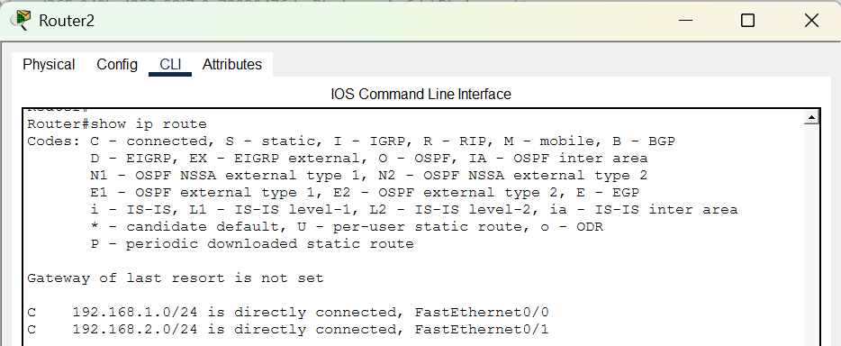
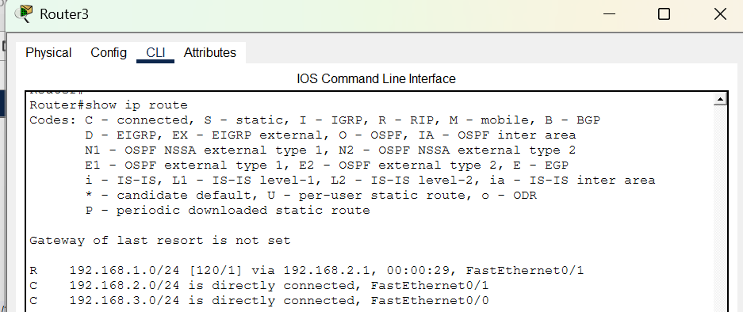
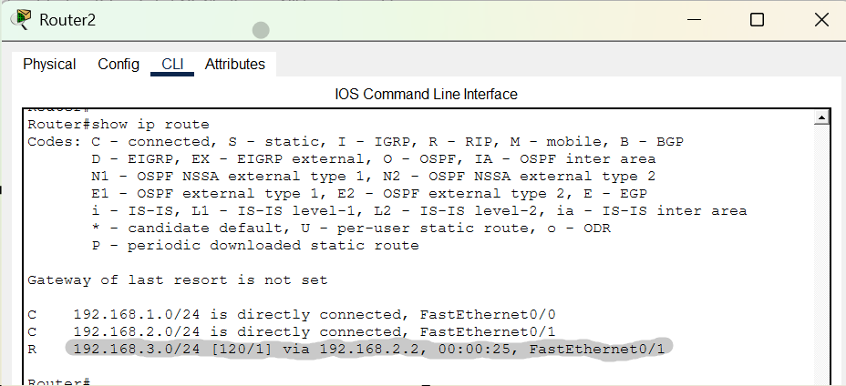
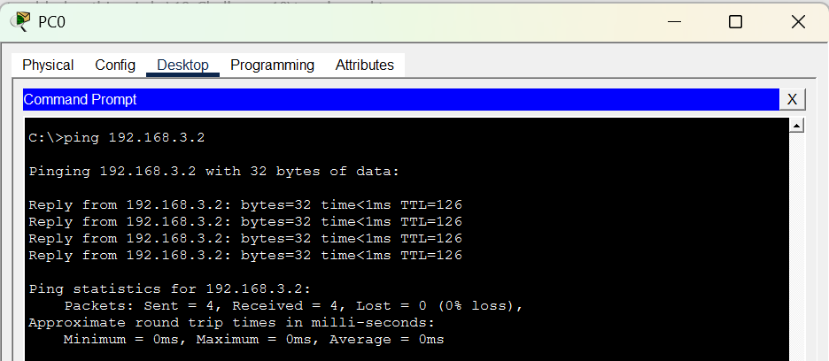

# Challenge 6 — RIP Network Cannot Reach the Destination

## Network Topology




---

# Challenge

PC0 needs to communicate with PC2.

RIP has been configured on **Router2 and Router3**, but when you try to ping PC2 from PC0, you receive **unreachable responses**.

Your task is to troubleshoot the RIP configuration and restore connectivity.

### Goal

Make this ping successful:

```bash
PC0> ping 192.168.3.2
```

---

# IP Addressing

| Device  | Interface | IP Address     |
| ------- | --------- | -------------- |
| PC0     | Fa0       | 192.168.1.2/24 |
| Router2 | Fa0/0     | 192.168.1.1/24 |
| Router2 | Fa0/1     | 192.168.2.1/24 |
| Router3 | Fa0/1     | 192.168.2.2/24 |
| Router3 | Fa0/0     | 192.168.3.1/24 |
| PC2     | Fa0       | 192.168.3.2/24 |

---

# Symptoms

When you run:

```bash
PC0> ping 192.168.3.2
```

the destination cannot be reached.

The physical links are working, and RIP is configured on both routers.

However, the routers are not successfully learning all the required networks.

---

# Troubleshooting

## Step 1 — Test the Local Gateway

From PC0:

```bash
PC0> ping 192.168.1.1
```

This should succeed.



---

## Step 2 — Check Router2's Routing Table

On Router2:

```bash
Router2# show ip route
```

Look for the destination network:

```text
192.168.3.0/24
```

Check whether Router2 has learned this network through RIP.

A RIP route will normally appear with:

```text
R
```



---

## Step 3 — Check Router3's Routing Table

On Router3:

```bash
Router3# show ip route
```

Check whether Router3 knows about:

```text
192.168.1.0/24
```



---

## Step 4 — Check the RIP Configuration

On Router2:

```bash
Router2# show running-config
```

Find:

```text
router rip
```

Then do the same on Router3:

```bash
Router3# show running-config
```

Look carefully at the networks configured under RIP.

Ask yourself:

> Are all directly connected networks included in RIP?

---

# Root Cause

The problem is in **Router3's RIP configuration**.

Router3 has the network:

```text
192.168.2.0/24
```

but the network:

```text
192.168.3.0/24
```

is missing from its RIP configuration.

Because `192.168.3.0/24` is not included in RIP, Router3 does not advertise that network to Router2.

Therefore, Router2 does not learn how to reach PC2's network.

---

# Fix

On Router3, enter configuration mode:

```bash
Router3# configure terminal
```

Enter RIP configuration:

```bash
Router3(config)# router rip
```

Add the missing network:

```bash
Router3(config-router)# network 192.168.3.0
```

If Router3 is using RIPv2, make sure it is configured appropriately:

```bash
Router3(config-router)# version 2
```

Then exit:

```bash
Router3(config-router)# end
```

---

# Verify RIP

On Router3:

```bash
Router3# show ip protocols
```

Verify that the appropriate networks are participating in RIP.

**[SCREENSHOT — Replace this section with an actual screenshot of `show ip protocols` on Router3.]**

---

# Verify the Routing Table

On Router2:

```bash
Router2# show ip route
```

You should now see a RIP route toward:

```text
192.168.3.0/24
```

It should appear with an `R`, for example:

```text
R    192.168.3.0/24 [120/1] via 192.168.2.2
```


---

# Final Test

From PC0:

```bash
PC0> ping 192.168.3.2
```

The ping should now succeed.

Example:

```text
Reply from 192.168.3.2: bytes=32 time<1ms TTL=126
Reply from 192.168.3.2: bytes=32 time<1ms TTL=126
Reply from 192.168.3.2: bytes=32 time<1ms TTL=126
Reply from 192.168.3.2: bytes=32 time<1ms TTL=126
```



---

# Troubleshooting Lesson

When using RIP, routers need to advertise the networks that should participate in the routing protocol.

In this topology:

```text
PC0
 |
Router2
 |
 | 192.168.2.0/24
 |
Router3
 |
 | 192.168.3.0/24
 |
PC2
```

Router3 is directly connected to:

```text
192.168.2.0/24
192.168.3.0/24
```

Both networks need to be properly included in the RIP configuration if they are intended to participate in RIP.

### Important command

```bash
router rip
network 192.168.3.0
```

This tells Router3 to include the `192.168.3.0` network in RIP.

### Useful troubleshooting commands

```bash
show ip route
```

```bash
show ip protocols
```

```bash
show running-config
```

```bash
ping <destination>
```

Remember:

> **If a network is missing from the routing protocol configuration, other routers may not learn how to reach that network.**
