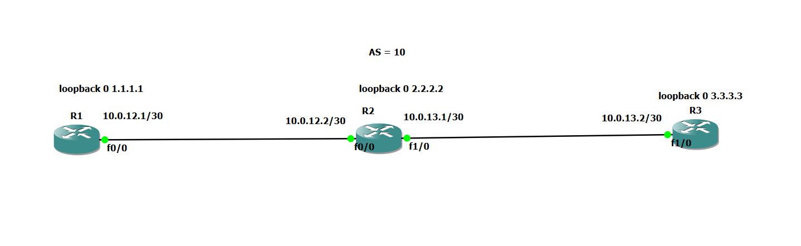
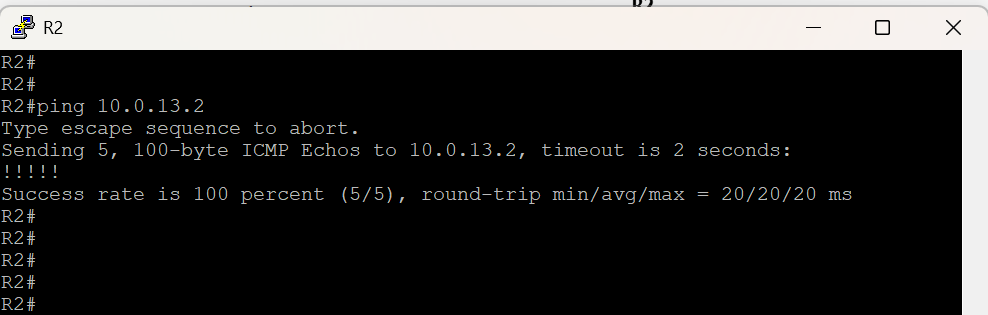
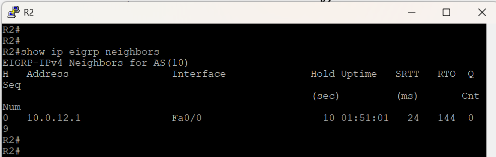
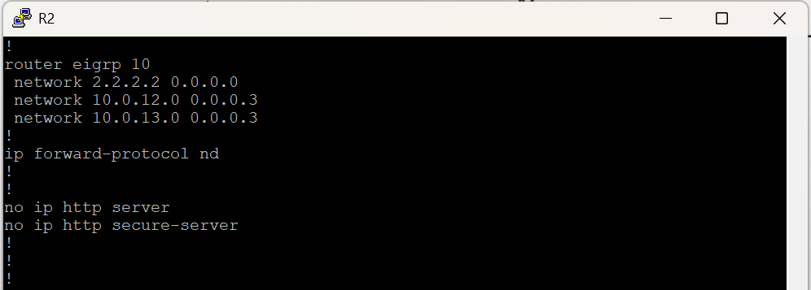
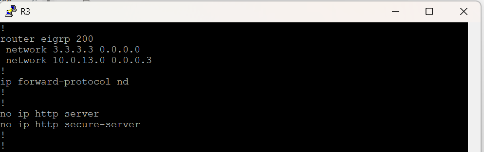
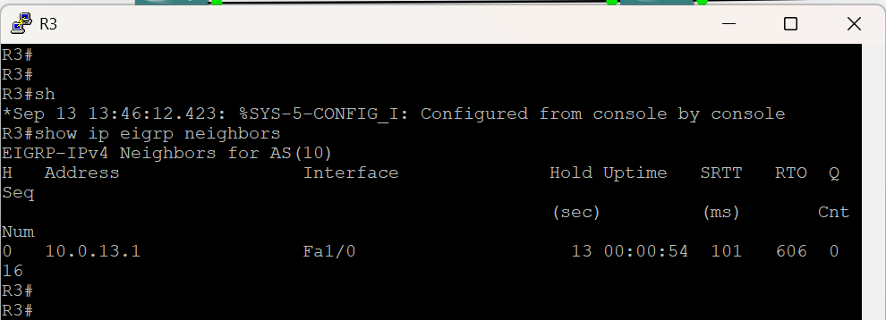
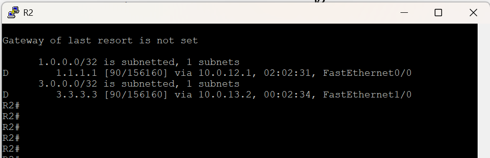
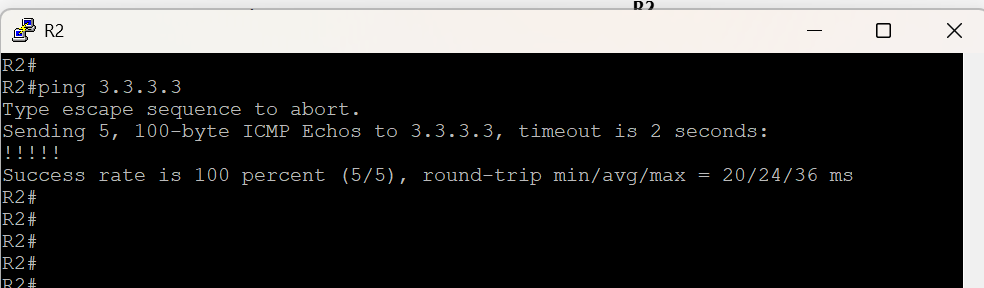

# Challenge — EIGRP AS Number Mismatch

> **Note:** This repository contains screenshots, configurations, commands, troubleshooting steps, and documentation for the lab. The original GNS3 project files and large router image files are **not included for download** because of their large file size. The screenshots provide evidence of the lab configuration, troubleshooting process, and results.

---

## Network Topology



> **Replace `topology1.png` with your actual topology screenshot filename.**

---

## Challenge

The routers are connected and configured to use **EIGRP**, but the EIGRP neighbor relationship does not form between **R2 and R3**.

The network uses:

```text
EIGRP Autonomous System: 10
```

However, **R3 is configured with a different EIGRP autonomous-system number**.

As a result, R2 and R3 cannot become EIGRP neighbors.

### Your Task

Troubleshoot the EIGRP configuration and find the reason why the neighbor relationship between R2 and R3 is not forming.

**Do not rebuild the topology.**

---

## Network Topology

```text
                    AS = 10

     Loopback0: 1.1.1.1       Loopback0: 2.2.2.2       Loopback0: 3.3.3.3
          [ R1 ]                    [ R2 ]                    [ R3 ]
           F0/0                      F0/0                      F1/0
             |                         |                         |
       10.0.12.1/30 ---------------- 10.0.12.2/30              |
                                                               |
                                      F1/0                     F1/0
                                       |                         |
                                10.0.13.1/30 ---------------- 10.0.13.2/30
```

---

## IP Addressing

| Device | Interface | IP Address   |
| ------ | --------- | ------------ |
| R1     | Loopback0 | 1.1.1.1      |
| R1     | F0/0      | 10.0.12.1/30 |
| R2     | Loopback0 | 2.2.2.2      |
| R2     | F0/0      | 10.0.12.2/30 |
| R2     | F1/0      | 10.0.13.1/30 |
| R3     | Loopback0 | 3.3.3.3      |
| R3     | F1/0      | 10.0.13.2/30 |

---

## Symptoms

The physical interfaces are configured, but the EIGRP neighbor relationship between R2 and R3 does not form.

On R2:

```bash
R2# show ip eigrp neighbors
```

R3 does not appear as an EIGRP neighbor.

There are also no EIGRP adjacency logs for that link.

The problem may be related to:

* EIGRP configuration on R2
* EIGRP configuration on R3
* EIGRP autonomous-system number
* Interface configuration
* IP connectivity

---

# Troubleshooting

## Step 1 — Test IP Connectivity

From R2, ping R3:

```bash
R2# ping 10.0.13.2
```

This checks whether R2 can reach R3 at the IP level.

If the ping succeeds, the basic IP connectivity is working.




---

## Step 2 — Check EIGRP Neighbors on R2

Run:

```bash
R2# show ip eigrp neighbors
```

Check whether R3 appears as an EIGRP neighbor.

If R3 is missing, the EIGRP adjacency has not formed.




---

## Step 3 — Check EIGRP Configuration on R2

Run:

```bash
R2# show running-config
```

Look for the EIGRP configuration.

R2 should be using:

```text
router eigrp 10
```

The number `10` is the EIGRP **autonomous-system number**.




---

## Step 4 — Check EIGRP Configuration on R3

On R3, run:

```bash
R3# show running-config
```

Look for:

```text
router eigrp
```

Check the autonomous-system number.

R3 is configured with a **different AS number** from R1 and R2.

For example:

```text
R1 → EIGRP AS 10
R2 → EIGRP AS 10
R3 → EIGRP AS 200
```

This is the problem.




---

# Root Cause

The problem is caused by an **EIGRP autonomous-system number mismatch**.

R1 and R2 use:

```text
EIGRP AS 10
```

but R3 uses:

```text
EIGRP AS 200
```

Therefore, R2 and R3 do not form an EIGRP neighbor relationship.

```text
R2                         R3
EIGRP AS 10       X       EIGRP AS 200
       ↓                         ↓
             No adjacency
```

### Important

For EIGRP neighbors to form, the routers must use the **same EIGRP autonomous-system number**.

---

# Solution

Change R3's EIGRP autonomous-system number from **200 to 10**.

On R3:

```bash
R3# configure terminal
R3(config)# router eigrp 10
```

Make sure the correct networks are included in the EIGRP process.

For example:

```bash
R3(config-router)# network 10.0.13.0 0.0.0.3
R3(config-router)# network 3.3.3.3 0.0.0.0
```

Then:

```bash
R3(config-router)# end
```

---

# Verify the Neighbor Relationship

On R2:

```bash
R2# show ip eigrp neighbors
```

R3 should now appear as an EIGRP neighbor.

You should see information similar to:

```text
Address          Interface
10.0.13.2        FastEthernet1/0
```




---

# Verify the Routing Table

On R2:

```bash
R2# show ip route
```

You should now see EIGRP-learned routes marked with:

```text
D
```

`D` means the route was learned through **EIGRP**.

For example:

```text
D    3.3.3.3/32
```




---

# Final Test

From R2, test R3's loopback:

```bash
R2# ping 3.3.3.3
```

The ping should now succeed.

You can also test from R1:

```bash
R1# ping 3.3.3.3
```




---

# Troubleshooting Lesson

When using EIGRP, routers need compatible EIGRP configurations to become neighbors.

In this challenge:

```text
R1
 ↓
EIGRP AS 10
 ↓
R
```
